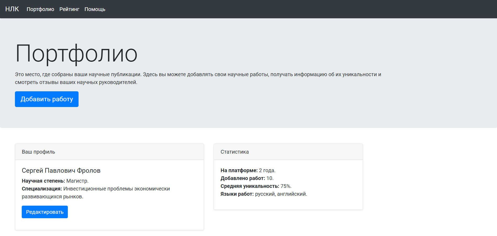
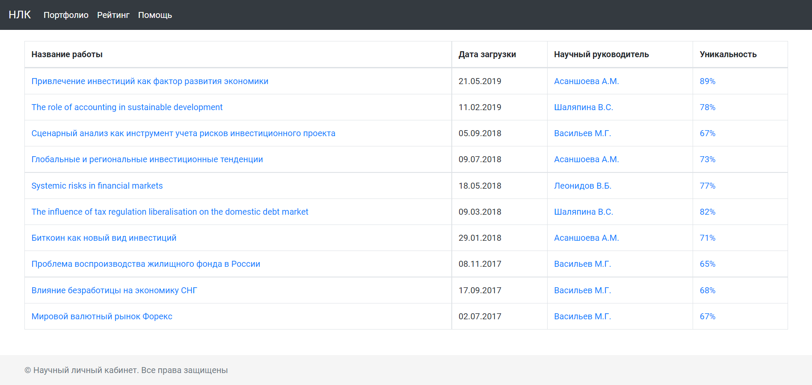

# Домашнее задание Stepik - Научный личный кабинет

Это решение задания Научный личный кабинет с курса "Веб-разработка для начинающих: HTML и CSS" (https://stepik.org/course/38218/info).

## Содержание

- [Обзор](#обзор)
  - [Требования](#требования)
  - [Скриншоты](#скриншоты)
  - [Полезные ресурсы](#полезные-ресурсы)
  - [Ссылки](#ссылки)

## Обзор

В этом домашнем задании нужно воспользоваться сеткой и компонентами Бутстрапа, чтобы создать адаптивную страницу Научного личного кабинета - выдуманного сервиса для размещения научных работ.

### Требования

Всего три основных экрана-брейкпоинта:

1. Большой - lg в классификации Бутстрапа.
2. Средний - md в классификации Бутстрапа.
3. Маленький - sm в классификации Бутстрапа.

### Скриншоты  
  
  
___

### Полезные ресурсы

- [Cards](https://getbootstrap.com/docs/5.2/components/card/)
- [Examples](https://getbootstrap.com/docs/5.2/examples/)
- [Grid system](https://getbootstrap.com/docs/5.0/layout/grid/)
- [Tables](https://getbootstrap.com/docs/5.0/content/tables/)
- [Видео урок по Bootstrap 5](https://www.youtube.com/watch?v=CvMxvb2D8Iw&t=8063s)

### Ссылки

- URL-адрес решения: [Github](https://github.com/kris-mkv/scientific-personal-account)
- URL-адрес живого сайта: [Github Page](https://kris-mkv.github.io/scientific-personal-account/)
- Макет в фигме: [Макет](https://www.figma.com/file/nDXdlmr1kCVnWEcnPWtfLg/%D0%97%D0%B0%D0%B4%D0%B0%D0%BD%D0%B8%D0%B5-%D0%BD%D0%B0-%D0%91%D1%83%D1%82%D1%81%D1%82%D1%80%D0%B0%D0%BF)

